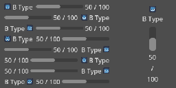
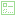
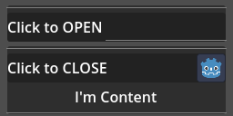

# Godot Ui Controls Combo Addons

### What dose this addons done?

- Add some preset UI controls combo

### Any Document for Detail?

- for property and signal -> see description inside editor
- for method -> [here](DOCUMENT.md) **WIP**

## Available Controls Combo

### 1. Baisc UI Combo

###### *SIMPLE LIFE HACKS COMBO*

- *create multi node combo by simple input automatically*

> ##  Status Label
>
> 
> 
> - Structure:
>   - **[ HBoxContainer ]** *:* **[ Icon ]**, **[ Name ]**, *[ Space ]*, **[ Value ]**
> - Feature:
>   - Can swap Left-Right position with one-click *(controled by bool value)*
>   - Can swap Icon-Name position with one-click *(controled by bool value)*

> ##  Resource Label TypeA
>
> 
> 
> - Structure:
>   - **[ BoxContainer ]** *:*
>     - **[ HBoxContainer ]** *:* **[ Icon ]**, **[ Name ]**, *[ Space ]*, **[ Current Value ]**, **[ Max Value ]**
>     - *[ Space ]*
>     - **[ ProgressBar ]**
> - Feature:
>   - Can swap Left-Right position with one-click *(controled by bool value)*
>   - Can swap Icon-Name position with one-click *(controled by bool value)*
>   - Can swap Labels-ProgressBar position with one-click *(controled by bool value)*
>   - Can change ProgressBar position to left/right with one-click *(controled by bool value, set BoxContainer vertical)*

> ##  Resource Label TypeB
>
> 
> 
> - Structure:
>   - **[ BoxContainer ]** *:* **[ Icon ]**, **[ Name ]**, *[ Space ]*, **[ ProgressBar ]**, **[ Current Value ]**, **[ Max Value ]**
> - Feature:
>   - Can swap Left-Right position with one-click *(controled by bool value)*
>   - Can swap Icon-Name position with one-click *(controled by bool value)*
>   - Can swap ProgressBar-Value position with one-click *(controled by bool value)*
>   - Can change whole Node to vertical

### 2. Menu Combo

###### *HIGH CUSTOMIZABLE FUNCTIONAL COMBO*

- *MUST ASSIGN NODE to activate*
- *Can use Godot build-in focus system or disable than control by calling func instead*

> ##  Button
>
> 
> 
> - Structure:
>   - **[ Any BaseButton ]**
> - Need to PLACE any BaseButton NODE as CHILD, and ASSIGN them to activate

> ##  Option Button
>
> 
> 
> - Structure:
>   - **[ OptionButton ]**
> - Need to PLACE any OptionButton NODE as CHILD, and ASSIGN them to activate

> ##  Switch
>
> 
> 
> - Structure:
>   - **[ Any BaseButton ] x 2**
>   - **[ CheckButton ]**
> - Need to PLACE *"any two BaseButton"* or *"CheckButton"* or *both* NODE as CHILD, and ASSIGN them to activate

> ##  Radio Button
>
> 
> 
> - Structure:
>   - **[ Any BaseButton ] x n**
> - Need to PLACE one or more BaseButton NODE as CHILD, and ASSIGN them to activate

> ##  Slider
>
> 
> 
> - Structure:
>   - **[ Any Slider ]**
>   - **[ Label (Optional, for value display) ]**
>   - **[ Any BaseButton (Optional, for mouse click value step) ] x 2**
> - Need to PLACE any Slider NODE as CHILD, and ASSIGN them to activate

> ##  Node Hider
>
> 
> 
> - Structure:
>   - **[ Any Node (Optional, visible while button pressed) ] x n**
>   - **[ Any Node (Optional, visible while button released) ] x n**
> - AUTO CREATE a invisible toggle button and switch assigned node visible by button state

### 3. NON Controls Combo UI Node (maybe SHOULD NOT be here)

###### *ANOTHER SIMPLE LIFE HACKS NODE*

- *auto draw content by simple value input*
- *well... maybe they not count as controls combo...*

> ##  Resource Indicator
>
> 
> 
> - Use Draw func to simple draw out **Multi Line** like ProgressBar inside BoxContainer to display input value
> - Feature:
>   - Can draw value with format setting
>   - Can set line size, sperate size and draw offset
>   - Can adjust color
>   - Can switch to Verticle

