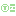

# Godot Ui Controls Combo Addons

### What's this addons done?

> Add some preset controls combo for UI

### Available Controls Combo

1. Basic Combo

> ##  Status Label
> 
> - Structure: **[ Icon ]**, **[ Name ]**, *[ Space ]*, **[ Value ]**
> - Can swap Left-Right position with one-click *(controled by bool value)*
> - Can swap Icon-Name position with one-click *(controled by bool value)*

> ##  Resource Label
> 
> - Structure: **[ Icon ]**, **[ Name ]**, *[ Space ]*, **[ Current Value ]**, **[ Max Value ]**
> - Can swap Left-Right position with one-click *(controled by bool value)*
> - Can swap Icon-Name position with one-click *(controled by bool value)*

> ##  Icon Label
> 
> - Structure: **[ Icon ]**, *[ Space ]*, **[ Value ]**
> - Can swap Left-Right position with one-click *(controled by bool value)*

2. Menu Combo
