# Godot Ui Controls Combo Addons

### What's this addons done?

> Add some preset controls combo for UI

### Available Controls Combo

1. UI Combo

> ##  Status Label
>
> 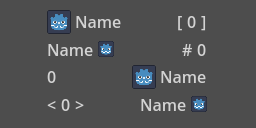
> 
> - Structure:
> - - **[ HBoxContainer ]** ***:*** **[ Icon ]**, **[ Name ]**, *[ Space ]*, **[ Value ]**
> - Can swap Left-Right position with one-click *(controled by bool value)*
> - Can swap Icon-Name position with one-click *(controled by bool value)*

> ## 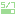 Resource Label
>
> 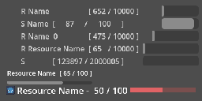
> 
> - Structure:
> - - **[ VBoxContainer ]** ***:***
> - - - **[ HBoxContainer ]** ***:*** **[ Icon ]**, **[ Name ]**, *[ Space ]*, **[ Current Value ]**, **[ Max Value ]**
> - - - **[ ProgressBar ]**
> - Can swap Up-Down position with one-click *(controled by bool value)*
> - Can swap Left-Right position with one-click *(controled by bool value)*
> - Can swap Icon-Name position with one-click *(controled by bool value)*

2. Menu Combo

> ##  Button
>
> 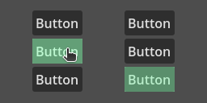
> 
> - Structure: **[ Any BaseButton ]**
> - Need to PLACE any BaseButton NODE as CHILD, and ASSIGN them to made it work
> - Can use Godot build-in focus system or disable and control by calling func

> ##  Option Button
>
> 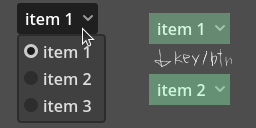
> 
> - Structure: **[ OptionButton ]**
> - Need to PLACE any OptionButton NODE as CHILD, and ASSIGN them to made it work
> - Can use Godot build-in focus system or disable and control by calling func

> ## 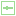 Slider
>
> 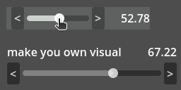
> 
> - Structure: **[ Any Slider ]**, **[ Label (Optional, for value display) ]**
> - Need to PLACE any OptionButton NODE as CHILD, and ASSIGN them to made it work
> - Can use Godot build-in focus system or disable and control by calling func

> ## 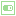 Switch
>
> 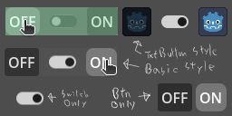
> 
> - Structure: **[ Any BaseButton ] x 2**, **[ CheckButton ]**
> - Need to PLACE *"any two BaseButton"* or *"CheckButton"* or *both* NODE as CHILD, and ASSIGN them to made it work
> - Can use Godot build-in focus system or disable and control by calling func

> ##  Radio Button
>
> 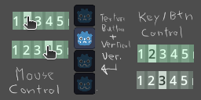
> 
> - Structure: **[ Any BaseButton ] x n**
> - Need to PLACE one or more BaseButton NODE as CHILD, and ASSIGN them to made it work
> - Can use Godot build-in focus system or disable and control by calling func

> ##  BoxContainer Tab
>
> 
> 
> - Structure: **[ Any Node (for auto show) ] x n**, **[ Any Node (for auto hide) ] x n**
> - Need to ASSIGN NODE to made it work
> - AUTO CREATE a invisible toggle button and switch assigned node visible by button state
> - Can use Godot build-in focus system or disable and control by calling func

3. NON Controls Combo UI Node (Bonus Content, maybe SHOULD NOT be here)

> ##  Resource Indicator
>
> 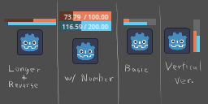
> 
> - Use Draw func to simple draw out **Multi Line** like ProgressBar inside BoxContainer to display input value
> - Can active value draw out with format setting
> - Can switch to Verticle Version
> - NOT set position itself, attach to target Node and set position offset manually

