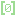

# Godot Ui Controls Combo Addons

### What's this addons done?

> Add some preset controls combo for UI

### Available Controls Combo

1. Basic Combo

> ##  Status Label
>
> 
> 
> - Structure inside **HBoxContainer**: **[ Icon ]**, **[ Name ]**, *[ Space ]*, **[ Value ]**
> - Can swap Left-Right position with one-click *(controled by bool value)*
> - Can swap Icon-Name position with one-click *(controled by bool value)*

> ##  Resource Label
>
> 
> 
> - Structure inside **HBoxContainer**: **[ Icon ]**, **[ Name ]**, *[ Space ]*, **[ Current Value ]**, **[ Max Value ]**
> - Can swap Left-Right position with one-click *(controled by bool value)*
> - Can swap Icon-Name position with one-click *(controled by bool value)*

2. Menu Combo

> ##  Button
>
> 
> 
> - Structure: **[ Any BaseButton ]**
> - Need to PLACE any BaseButton NODE as CHILD, and Assign them to made it work
> - Can use Godot build-in focus system or disable and control by calling func

> ##  Switch
>
> 
> 
> - Structure: **[ Any BaseButton ]** x 2, **[ CheckButton ]**
> - Need to PLACE *"any two BaseButton"* or *"CheckButton"* or *both* NODE as CHILD, and Assign them to made it work
> - Can use Godot build-in focus system or disable and control by calling func
